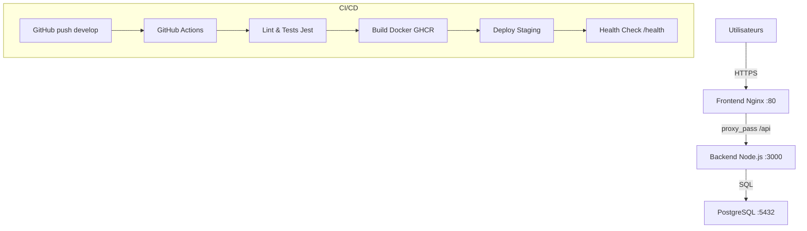

# VitalSync — Chaîne CI/CD conteneurisée

Application de suivi médical et sportif — Épreuve E6 EFREI 2026

## Architecture



## Stack technique

| Composant | Technologie |
|---|---|
| Backend API | Node.js 20 / Express |
| Frontend | HTML/JS servi par Nginx alpine |
| Base de données | PostgreSQL 15 alpine |
| Conteneurisation | Docker multi-stage |
| Orchestration locale | Docker Compose |
| Orchestration prod | Kubernetes (manifestes k8s/) |
| CI/CD | GitHub Actions |
| Registry | GitHub Container Registry (GHCR) |

## Prérequis

- Docker Desktop >= 4.x
- Git >= 2.x
- Node.js 20 (pour développement local uniquement)
- Compte GitHub (pour CI/CD)

## Lancer l'application en local

```bash
# 1. Cloner le dépôt
git clone https://github.com/luldrako/vitalsync.git
cd vitalsync

# 2. Créer le fichier d'environnement
cp .env.example .env
# Remplir POSTGRES_PASSWORD dans .env

# 3. Lancer les 3 services
docker compose up --build

# 4. Accéder à l'application
open http://localhost
```

## Pipeline CI/CD

La pipeline se déclenche automatiquement sur :
- **Push sur `develop`** → pipeline complète (lint, build, staging)
- **Pull Request vers `main`** → lint + tests uniquement

**Étapes :**
1. **Lint & Tests** — `npm ci` + ESLint + Jest
2. **Build & Push** — images Docker taguées avec le SHA du commit → GHCR
3. **Deploy staging** — `docker compose up` + health check sur `/health`

## Choix techniques

- **Scaleway** → hébergement souverain français, conformité RGPD données de santé
- **Multi-stage build** → image de prod sans devDependencies (~170MB vs ~1GB)
- **node:20-alpine** → image minimale, surface d'attaque réduite
- **Blue/Green deployment** → rollback en < 10s en cas de bug critique
- **GitHub Actions** → intégration native avec GHCR, gratuit pour repos publics

## Structure du projet

```
vitalsync/
├── .github/workflows/ci-cd.yml   # Pipeline GitHub Actions
├── backend/
│   ├── Dockerfile                # Multi-stage build
│   ├── .dockerignore
│   ├── server.js
│   ├── package.json
│   └── test/health.test.js
├── frontend/
│   ├── Dockerfile
│   ├── nginx.conf                # Reverse proxy /api → backend
│   └── index.html
├── k8s/                          # Manifestes Kubernetes
│   ├── backend-deployment.yaml
│   ├── backend-service.yaml
│   ├── frontend-ingress.yaml
│   └── postgres-secret.yaml
├── docker-compose.yml
├── .env.example
└── README.md
```
